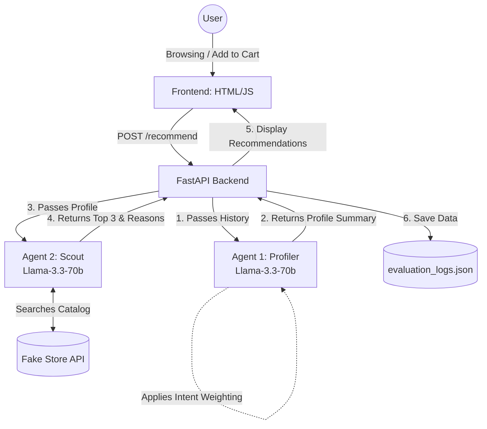

# NexShop — Multi-Agent E-Commerce Recommendation System


NextShop is a proof-of-concept e-commerce platform that leverages a **Dual-Agent LLM Architecture** to provide hyper-personalized, real-time product recommendations based on user browsing behavior and intent analysis.NexShop is a proof-of-concept e-commerce platform that leverages a **Dual-Agent LLM Architecture** to provide hyper-personalized, real-time product recommendations based on user browsing behavior and intent analysis..

---

## 🏗️ Architecture
The system is divided into a Real-Time Recommendation Pipeline and an Offline Evaluation Pipeline.



---

## 🚀 Quickstart

### 1. Install backend dependencies

```bash
cd backend
pip install -r requirements.txt
```

### 2. Set your Groq API key

Edit `main.py` line 17:
```python
GROQ_API_KEY = "YOUR_GROQ_API_KEY_HERE"
```
and the same in `evaluate_system.py` line 12
Or set as environment variable:
```bash
export GROQ_API_KEY="gsk_your_key_here"
```

Get a free key at: https://console.groq.com

### 3. Start the backend

```bash
uvicorn main:app --reload --port 8000
```

Backend will be live at: http://localhost:8000
Interactive API docs: http://localhost:8000/docs

### 4. Make your domain:
upload `index.html` on  https://netlify.com and take your domain

### 5. Open the frontend
Use the domain and enjoy!

---

## 🔌 API Endpoints

| Method | Endpoint | Description |
|--------|----------|-------------|
| GET | `/health` | Status check |
| GET | `/products` | All products from Fake Store API |
| GET | `/categories` | Available categories |
| GET | `/products/{category}` | Products by category |
| POST | `/recommend` | Run dual-agent recommendation pipeline |

### POST /recommend — Request Body

```json
{
  "user_id": "user_abc123",
  "history": [
    { "action": "search", "keyword": "gaming monitor" },
    { "action": "view", "product_id": 3, "product_category": "electronics", "price": 599.99 },
    { "action": "add_to_cart", "product_id": 7, "product_category": "electronics", "price": 99.99 }
  ]
}
```

### POST /recommend — Response

```json
{
  "user_id": "user_abc123",
  "profile_summary": "User is interested in electronics, particularly monitors and peripherals...",
  "recommendations": [
    {
      "product": { "id": 1, "title": "...", "price": 599.99, ... },
      "reason": "Matches interest in high-end electronics within budget"
    },
    ...
  ]
}
```

---

## 🤖 How the Agents Work

**Agent 1 — Profiler (LangChain Chain)**
- Input: Raw user history JSON
- Uses: LLM only (no tools)
- Output: 2-3 line behavioral summary (category interest + budget estimate + keywords)

**Agent 2 — Scout (LangChain Agent + Tool)**
- Input: Profile summary from Agent 1
- Uses: `fetch_products_from_store` tool → calls Fake Store API
- Selects top 5 product IDs + reasons
- Returns structured JSON for enrichment

---

## 🎨 Frontend Features

- **Live product catalog** from Fake Store API (with category filtering)
- **Activity log** — all views, searches, cart adds, purchases are tracked
- **Persistent history** — saved to localStorage across sessions
- **Dual-agent recommendations** — click "Get AI Recommendations" after browsing
- **Product modal** — full details, description, ratings
- **Cart** with checkout simulation

---

## 🔧 Customization

To use a real store API, replace the `fetch_all_products()` function in `main.py`:

```python
def fetch_all_products():
    response = requests.get("https://YOUR_REAL_API/products")
    return response.json()  # must return list of dicts with id, title, price, category, image
```

To change the frontend API URL, edit the top of `index.html`:
```javascript
const API_BASE = "http://localhost:8000";  // Change to your deployed backend URL
```
